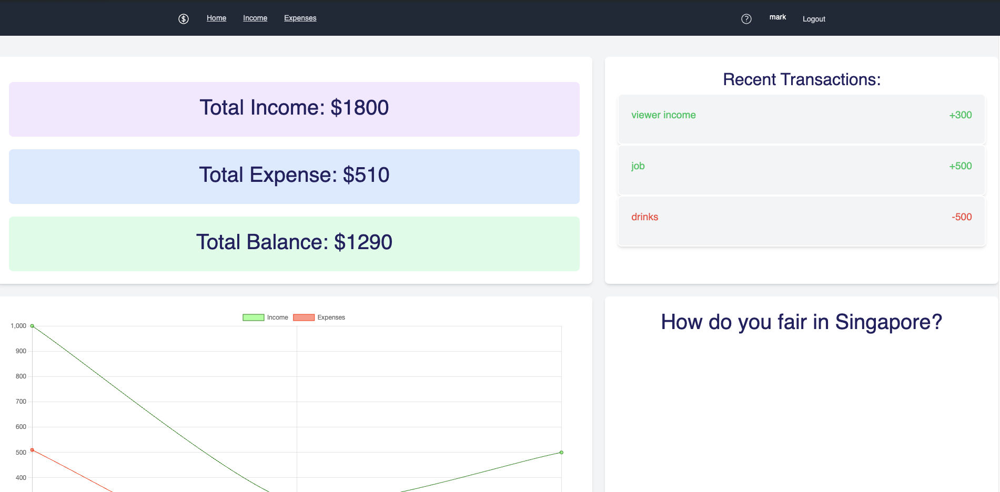
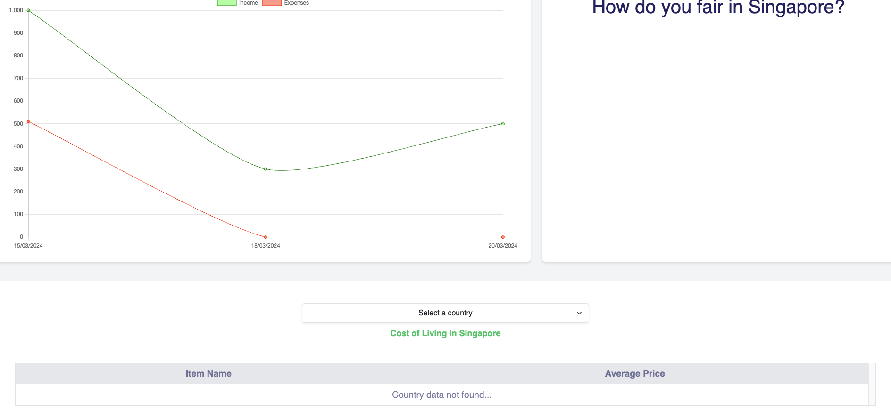
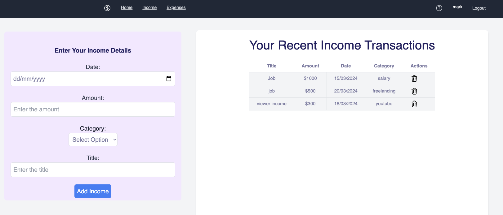
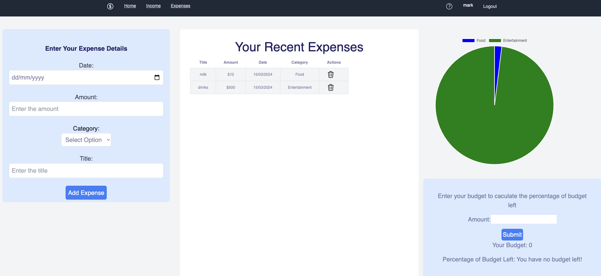

# ExpenseTrackingSystem





## About
The goal of this project is not to build the perfect website. But, to focus on exploring ideas and new technologies for being. This is one of the first projects that I built when starting to learn about programming.


## Getting Started
Get the project up and running by following the steps below

1. Create a personal Fork of this repository
2. 
2. Open two terminals (backend and frontend)
3. Change the directory for each terminal to the backend and frontend respectively
backend:
```
cd backend
```
OR
```
cd "<INSERT BACKEND FILE PATH>"
```
frontend:
```
cd frontend
```
OR
```
cd "<INSERT FRONTEND FILE PATH>"
```
4. run the following command in both the backend and frontend terminals:
```
npm install
```
Install the following modules in this project:
```
npm install -D tailwindcss express cors mongoose bycrypt jsonwebtoken axios 
```
5. Run the local servers for the backend and frontend on both terminals using, and **DONE**!
```
npm run start
```

## Built With
- [MongoDB](https://www.mongodb.com/)
- [Express](https://expressjs.com/)
- [ReactJS](https://react.dev/)
- [NodeJS](https://nodejs.org/en)